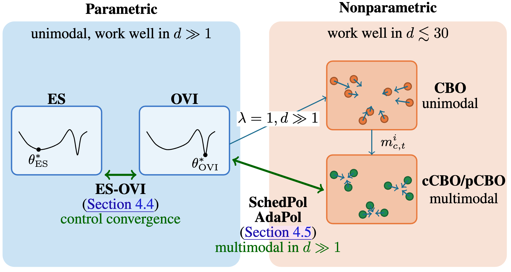

# Bridging Spherical Black Box Optimizers


This repository contains our implementations of ES, OVI, CBO, pCBO, cCBO, as well as our newly proposed ES-OVI, SchedPol and AdaPol methods.

Our implementation is closely based on [evosax](https://github.com/RobertTLange/evosax).


### Installation
Please install using `uv`, by simply copying our repository and using

```
uv sync
```


### Running experiments:


For BBOB, use for example
```
uv run train_bbob.py
```
This script includes hyper-parameter sweeps for the different optimizers, as well as evaluation on the different BBOB tasks.

For brax, use for example
```
uv run train_brax.py --stratname OpenESOVI
```
This script does include hyperparameter sweeps as an option, but not by default. It also only runs a single environment. See the CLI arguments inside the scripts for options.